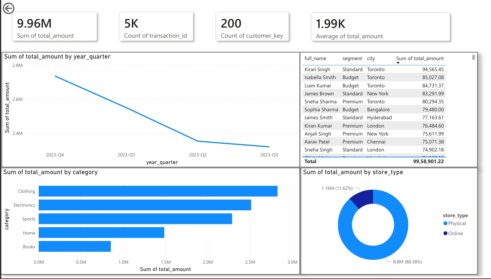

# 🏪 End-to-End Retail Lakehouse — Microsoft Fabric


## 📊 Dashboard Preview


---
A production-grade **Medallion Architecture** data lakehouse built entirely on **Microsoft Fabric**, ingesting 500K+ retail transactions through Bronze → Silver → Gold layers with SCD Type-2 customer history and sub-second DirectLake reporting.

---

## 🏗️ Architecture Overview

```mermaid
flowchart LR
    subgraph Sources["📁 Source Files"]
        A[customers.csv]
        B[products.csv]
        C[stores.csv]
        D[transactions.csv]
    end

    subgraph Medallion["🏅 Medallion Architecture - Microsoft Fabric"]
        direction LR
        subgraph Bronze["🥉 Bronze"]
            E[Raw Delta Tables]
        end
        subgraph Silver["🥈 Silver"]
            F[Cleaned & Enriched]
        end
        subgraph Gold["🥇 Gold"]
            G[fact_sales]
            H[dim_customer SCD2]
            I[dim_product]
            J[dim_store]
            K[dim_date]
        end
        Bronze --> Silver --> Gold
    end

    subgraph Serving["📊 Serving Layer"]
        L[DirectLake Semantic Model]
        M[Power BI Dashboard]
    end

    Sources --> Bronze
    Gold --> L --> M
```

```

---

## 📁 Project Structure
```text
retail-lakehouse/
├── README.md
├── dashboard.png
├── data/
│   ├── customers.csv
│   ├── products.csv
│   ├── stores.csv
│   ├── transactions.csv
│   └── customers_updated.csv
├── notebooks/
│   ├── 01_bronze_ingestion.ipynb
│   ├── 02_silver_transformation.ipynb
│   └── 03_gold_star_schema.ipynb
├── pipelines/
│   └── PL_RetailLakehouse_FullLoad.json
└── sql/
    └── gold_ddl_and_queries.sql

```

---

## 🔄 Data Flow

### 🥉 Bronze Layer — Raw Ingestion
- Reads CSVs from the Lakehouse `Files/raw_data/` section
- Writes as-is to Delta tables with 4 metadata columns added:
  - `_bronze_ingested_at` — ingestion timestamp
  - `_source_file` — origin file path
  - `_batch_run_ts` — pipeline batch identifier
  - `_is_deleted` — soft-delete flag
- Full load overwrites; append mode for incremental

### 🥈 Silver Layer — Cleansing & Transformation
| Transformation | Details |
|---|---|
| Null filtering | Removes rows with null primary keys |
| Deduplication | `dropDuplicates()` on natural keys |
| Type casting | Proper `DoubleType`, `IntegerType`, `DateType` |
| String normalisation | `trim()`, `initcap()`, `lower()` |
| Date enrichment | Year, month, quarter, day-of-week, weekend flag |
| Derived metrics | `gross_revenue`, `discount_amount`, `gross_margin_pct` |
| Email parsing | `email_domain` extracted from email |
| Price tiers | Budget / Mid-Range / Premium classification |

### 🥇 Gold Layer — Star Schema

```
                    ┌──────────────┐
                    │   dim_date   │
                    └──────┬───────┘
                           │ date_key
┌──────────────┐           │            ┌───────────────────┐
│  dim_store   ├───────────┤            │  dim_customer     │
│              │  store_key│            │  (SCD Type-2)     │
└──────────────┘           │            │                   │
                    ┌──────▼───────┐    │  • effective_start│
                    │  fact_sales  ├────┤  • effective_end  │
                    │              │    │  • is_current     │
                    └──────┬───────┘    └───────────────────┘
                           │ product_key
                    ┌──────▼───────┐
                    │  dim_product │
                    └──────────────┘
```

**SCD Type-2 Flow for `dim_customer`:**
```
Customer changes city or segment
         │
         ▼
Old row: is_current=False, effective_end_date = today
New row: is_current=True, effective_start_date = today, effective_end_date = 9999-12-31
```

---

## 🚀 How I Built This

### Environment
- Microsoft Fabric workspace with Trial capacity
- Lakehouse named `RetailLakehouse` with OneLake storage

### Step 1 — Data Ingestion (Bronze Layer)
- Generated synthetic retail dataset: 200 customers, 25 products, 8 stores, 5,000 transactions
- Uploaded CSVs to Lakehouse `Files/raw_data/` section
- Ran `01_bronze_ingestion.ipynb` — ingested all 4 tables as Delta format with metadata columns

### Step 2 — Transformation (Silver Layer)
- Ran `02_silver_transformation.ipynb`
- Applied PySpark transformations: null handling, deduplication, type casting, date enrichment
- Derived new columns: `gross_margin_pct`, `price_tier`, `email_domain`, `is_weekend`

### Step 3 — Star Schema (Gold Layer)
- Ran `03_gold_star_schema.ipynb`
- Built `fact_sales` joined with 4 dimensions
- Implemented SCD Type-2 MERGE logic for `dim_customer` tracking city and segment changes

### Step 4 — Power BI Dashboard
- Created DirectLake semantic model on all 5 Gold tables
- Defined 4 relationships (fact → dimensions)
- Built dashboard with KPI cards, revenue trends, category analysis, and customer rankings

---

## 📊 Sample Data Schema

### transactions.csv (5,000 rows — scale to 500K+)
| Column | Type | Example |
|---|---|---|
| transaction_id | string | TXN0000001 |
| customer_id | string | CUST0042 |
| product_id | string | PROD0003 |
| store_id | string | STORE002 |
| transaction_date | date | 2023-07-15 |
| quantity | int | 2 |
| unit_price | decimal | 499.99 |
| discount_pct | decimal | 0.10 |
| total_amount | decimal | 899.98 |
| payment_method | string | Credit Card |
| status | string | Completed |
| source_system | string | WebApp |

---

## ⚡ Tech Stack

| Component | Technology |
|---|---|
| Compute | Microsoft Fabric Spark (PySpark) |
| Storage | OneLake — Delta Lake (Parquet + transaction log) |
| Orchestration | Fabric Pipelines |
| Serving | DirectLake Semantic Model |
| Reporting | Power BI |
| Format | Delta Lake (ACID, time travel, schema evolution) |

---

## 📈 Key Design Decisions

**Why Medallion Architecture?**
Each layer serves a distinct purpose — Bronze preserves raw data for reprocessing, Silver provides a clean conformed layer, Gold delivers business logic for consumption.

**Why SCD Type-2?**
Customer attributes like city and segment change over time. SCD Type-2 preserves the historical segment at the time of each transaction, enabling accurate cohort analysis.

**Why DirectLake?**
DirectLake reads Delta tables directly from OneLake without importing data into Power BI, eliminating refresh cycles and delivering sub-second query performance on the full dataset.

---

## 🔍 Sample Analytical Queries

All queries are available in `sql/gold_ddl_and_queries.sql`. Highlights:
- Monthly revenue trend with AOV
- Revenue by category and price tier
- Top 10 customers by lifetime value
- Return rate analysis by product category
- Online vs physical store comparison
- Customer history via SCD Type-2

---

*Built as part of a Microsoft Fabric data engineering portfolio*
